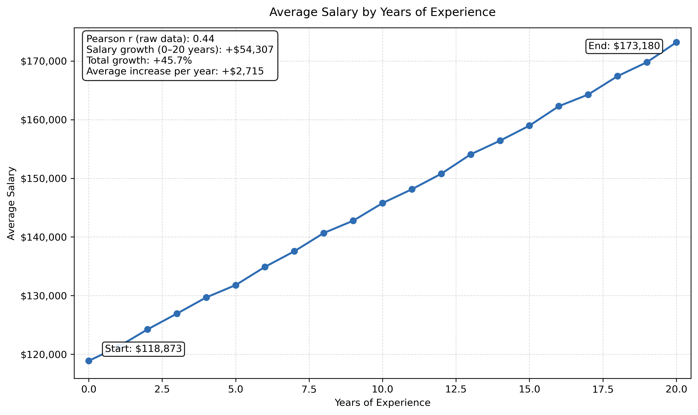
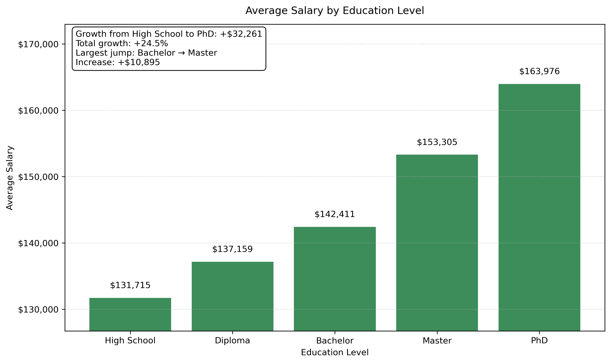
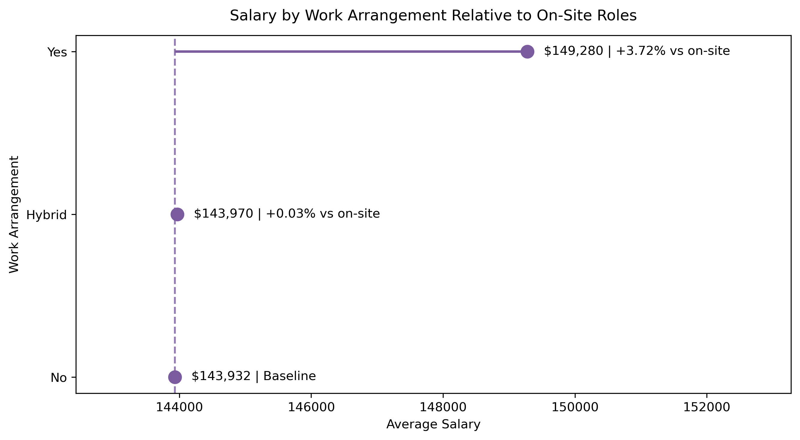
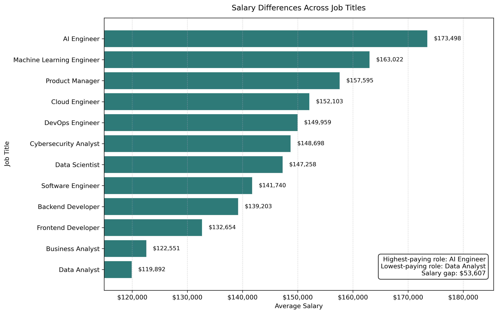

# SQL Salary Analysis: From Flat CSV to Relational Database

## Overview

This project explores salary patterns across technology and business-related roles by designing a relational database in MySQL, querying it with SQL, and visualizing the results in Python.

The project was developed as part of a SQL mini project for the Ironhack bootcamp, but it was also built with portfolio quality in mind. The goal was not only to answer analytical questions, but also to demonstrate a clean end-to-end workflow: database design, normalization, SQL analysis, and business storytelling through visualizations.

The original dataset was imported from Kaggle and transformed from a flat CSV structure into a normalized relational model with three linked tables.

## Dataset

The project is based on the **Job Salary Prediction Dataset** from Kaggle.

Source: [Kaggle - Job Salary Prediction Dataset](https://www.kaggle.com/datasets/nalisha/job-salary-prediction-dataset/data/code)

The dataset contains information about:

- job title
- years of experience
- education level
- skills count
- industry
- company size
- location
- remote work arrangement
- certifications
- salary

The original flat dataset was reorganized into a relational structure to improve consistency, reduce redundancy, and support more robust SQL analysis.

## Business Questions

The analysis focused on the following main questions:

1. How strongly does experience level influence salary?
2. Does education level significantly affect salary?
3. Do remote jobs pay more or less than non-remote jobs?
4. Is industry a major driver of salary differences?

Additional exploratory questions were also included to deepen the analysis:

- Which job titles offer the highest average salaries?
- Does remote work affect salary consistently across job titles?
- Does education level influence salary within specific job titles?
- Do industries differ more clearly when focusing on their highest-paid salary segment?

## Project Workflow

The project followed a structured workflow:

### 1. Data Import and Database Creation

The original CSV dataset was imported into MySQL as a raw table and then transformed into a normalized relational database.

### 2. Database Normalization

The flat dataset was split into three related tables:

- `job_profiles`
- `work_contexts`
- `salary_records`

This structure allowed the project to model professional profile information separately from work context and salary observations.

### 3. SQL Analysis

SQL was used as the main analytical tool to answer the business questions. The analysis included:

- `JOIN`
- `GROUP BY`
- `ORDER BY`
- `CASE`
- window functions such as `LAG()`
- common table expressions (`WITH` / CTEs)

### 4. Python Visualization

A Jupyter Notebook connected directly to the MySQL database and translated the SQL findings into visual insights using Python.

## Database Schema

The final relational model includes the following tables:

### `job_profiles`

Stores profile-level attributes:

- `job_profile_id`
- `job_title`
- `experience_years`
- `education_level`
- `skills_count`
- `certifications`

### `work_contexts`

Stores work environment and contextual attributes:

- `work_context_id`
- `industry`
- `company_size`
- `location`
- `remote_work`

### `salary_records`

Stores the salary observation and links the other two tables:

- `salary_record_id`
- `job_profile_id`
- `work_context_id`
- `salary`

This design makes it possible to analyze salary from multiple perspectives while maintaining a normalized and scalable structure.

## Key Findings

### Experience matters

Average salary rises steadily with years of experience. From 0 to 20 years of experience, average salary increases by more than $54,000, confirming that experience is one of the strongest salary drivers in the dataset.

### Education matters

Salary increases consistently across education levels, from High School to PhD. The largest gains appear at postgraduate stages, indicating that advanced education is associated with a meaningful salary uplift.

### Remote work has a moderate effect

Fully remote roles show a higher average salary than on-site roles, while hybrid positions remain almost identical to on-site positions. The remote effect exists, but it is moderate and mainly driven by fully remote roles.

### Industry matters less than expected

Industries show only minor variation in average salary. Even when focusing on the top 10% highest-paid records within each industry, salary differences remain small. This suggests that industry is not a major salary differentiator in this dataset.

### Job title is one of the strongest differentiators

Salary differences across job titles are substantial. AI Engineer, Machine Learning Engineer, and Product Manager appear at the top of the ranking, while Data Analyst and Business Analyst appear at the lower end. Compared with industry, job title provides a much stronger explanation of salary variation.

### Education still matters within roles

When comparing selected job titles, higher education remains associated with higher salary inside each role. This suggests that the education effect is not only driven by job title composition, but also holds within professions.

## Selected Visualizations

### Experience and Salary



This visualization shows a clear upward relationship between years of experience and average salary. It reinforces the idea that experience is one of the most important salary drivers in the dataset.

### Education and Salary



Average salary increases consistently across education levels, with the most pronounced gains appearing at postgraduate stages. This supports the view that advanced education is associated with higher compensation.

### Remote Work and Salary



Using on-site roles as the baseline, this chart shows that hybrid work has almost no salary effect, while fully remote roles display a moderate positive difference.

### Salary by Job Title



This chart highlights that job title is one of the strongest salary differentiators in the project, with clear gaps between the highest- and lowest-paying roles.

## Technologies Used

- **MySQL** for database creation, normalization, and SQL analysis
- **SQLAlchemy + PyMySQL** for connecting Python to MySQL
- **Python**
- **Pandas**
- **Matplotlib**
- **Jupyter Notebook (VS Code)**

## Repository Structure

## Repository Structure

```text
jobs_salary_analysis/
│
├── .gitignore
├── README.md
├── 01_schema.mwb
├── 02_data_loading.sql
├── 03_hypothesis_1_experience_salary.sql
├── 04_hypothesis_2_education_salary.sql
├── 05_hypothesis_3_remote_salary.sql
├── 06_hypothesis_4_industry_salary.sql
├── 07_additional_queries.sql
├── 08_Visualizations_notebook.ipynb
├── assets/
│   └── visualizations/
│       ├── education_salary.png
│       ├── experience_salary.png
│       ├── industry_salary.png
│       ├── job_title_salary.png
│       ├── remote_work_salary.png
│       └── education_within_roles.png
└── presentation/
    ├── job_salary_analysis_presentation.pdf
    └── job_salary_analysis_presentation.pptx
```

## Presentation

The class presentation is available in the `presentation/` folder in both PowerPoint and PDF format.

## How to Run the Project

### 1. Clone the repository

```bash
git clone <your-repository-url>
cd jobs_salary_analysis
```

### 2. Create the MySQL database

Run the schema and loading scripts in MySQL in the correct order.

### 3. Create a `.env` file

In the project root, create a `.env` file with your local MySQL credentials:

```env
MYSQL_USER=your_user
MYSQL_PASSWORD=your_password
MYSQL_HOST=localhost
MYSQL_PORT=3306
MYSQL_DATABASE=job_salary_db
```

### 4. Install Python dependencies

```bash
pip install pandas matplotlib sqlalchemy pymysql python-dotenv
```

### 5. Open the notebook

Run the notebook `08_Visualizations_notebook.ipynb` to reproduce the visual analysis.

## Why This Project Matters

This project demonstrates more than SQL syntax. It shows the ability to:

- design a relational database from a flat dataset
- normalize data into a defendable schema
- answer business questions with structured SQL analysis
- interpret findings critically instead of forcing conclusions
- communicate results through clean and purposeful visualizations

It also reflects an important analytical principle: not all variables matter equally. In this dataset, experience, education, and job title explain salary differences far better than industry.

## Future Improvements

Possible extensions of the project include:

- adding statistical tests to complement the descriptive analysis
- building SQL views for reusable analytical summaries
- creating an interactive dashboard in Power BI or Streamlit
- expanding the dataset with additional information such as company name, country, or time-based salary evolution

## Data Source

This project uses the **Job Salary Prediction Dataset** published on Kaggle.

## Author

Johannes Vidal

Aspiring Data Analyst / Business Analyst with a focus on SQL, Power BI, Python, and business-driven analytics.